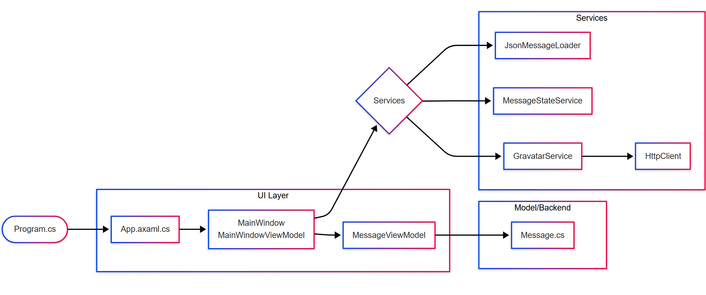
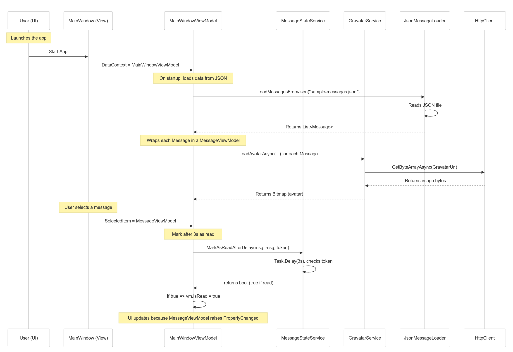

<readme>
  <header>
    <h1>MsgApp</h1>
    
A sample Avalonia MVVM application for my portofolio that demonstrates reading JSON-based messages, loading Gravatar avatars, and marking messages as read after a delay.
  </header>

  <section id="table-of-contents">
    <h2>Table of Contents</h2>
    <ul>
      <li><a href="#overview">Overview</a></li>
      <li><a href="#features">Key Features</a></li>
      <li><a href="#structure">Project Structure</a></li>
      <li><a href="#build-and-run">Build and Run</a></li>
      <li><a href="#mermaid-diagrams">Mermaid Diagrams</a></li>
      <li><a href="#contributing">Contributing</a></li>
      <li><a href="#license">License</a></li>
    </ul>
  </section>

  <section id="overview">
    <h2>Overview</h2>
    

      The <strong>MsgApp</strong> is a cross-platform desktop application built with
      <a href="https://avaloniaui.net">Avalonia</a>. It showcases a minimal MVVM pattern:
      messages are loaded from a JSON file, displayed in a list, and each message can be
      marked as read automatically after a delay.
    

  </section>

  <section id="features">
    <h2>Key Features</h2>
    <ul>
      <li>Loads messages from JSON (<code>sample-messages.json</code>) via <strong>JsonMessageLoader</strong>.</li>
      <li>Displays messages in a list, with <strong>MessageViewModel</strong> as the VM layer.</li>
      <li>Async avatar fetching from Gravatar with fallback images if offline.</li>
      <li>Automatic "mark as read" after 3 seconds if the user selects a message.</li>
      <li>Simple sorting by sender or date.</li>
      <li>Unit Tests with NUnit verifying components separately.</li>
    </ul>
  </section>

  <section id="structure">
    <h2>Project Structure</h2>
    <pre>
        MsgApp/
        ├── Models/
        │   └── Message.cs             (Plain data model)
        ├── ViewModels/
        │   ├── MainWindowViewModel.cs (Core VM)
        │   └── MessageViewModel.cs    (Wraps a single Message)
        ├── Services/
        │   ├── MessageStateService.cs (Handles delayed read logic)
        │   ├── GravatarService.cs     (Fetches avatars from Gravatar)
        │   ├── JsonMessageLoader.cs   (Loads messages from a JSON file)
        │   └── IsReadToTextStyleConverter.cs (UI value converter)
        ├── Views/
        │   ├── MainWindow.axaml       (Avalonia XAML layout)
        │   ├── MainWindow.axaml.cs    (Code-behind)
        │   ├── App.axaml              (Application resource dictionary)
        │   └── App.axaml.cs           (App entry point for Avalonia)
        ├── Program.cs                 (DI and app startup logic)
        └── MsgApp.csproj              (Project file)
    </pre>

## Architecture Diagrams

Below are two diagrams showing how the application’s components interact:

### Flow Diagram

### Sequence Diagram

  </section>

  <section id="build-and-run">
    <h2>Build and Run</h2>
    <ol>
      <li>Clone this repository.</li>
      <li>Open a terminal in the solution folder.</li>
      <li>Run <code>dotnet build</code> to compile.</li>
      <li>Optionally run <code>dotnet test</code> to run unit tests.</li>
      <li>Finally, run <code>dotnet run --project MsgApp</code> to launch the application.</li>
    </ol>
    

      You can also open the solution in Visual Studio, JetBrains Rider, or Visual Studio Code
      to debug and run directly.
    

  </section>

  <section id="license">
    <h2>License</h2>
    

      Distributed under the <a href="https://opensource.org/licenses/MIT">MIT License</a>.
    

  </section>
</readme>
